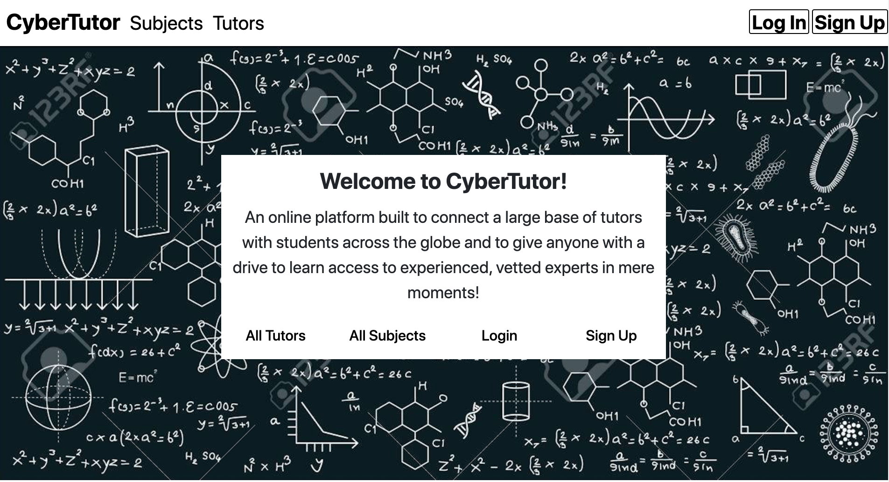

# CyberTutor: An Online Tutoring Platform

## Team Members
* Aditya Sridhar (as5883)
* Daniel Kang (hk3021)
* Nicholas Bethune (nab2189)

## Project Overview
We present the overview of our project's primary features and components:

* Login: we implemented a log-in feature that requires the user to log in to his or her account conventionally via username and password. Using `bcrypt`, we have server-side encrypted passwords for validation. Account info pages are login-protected, and unauthorized attempts at access will result in a redirect. Validation of account details includes checking for valid emails, preventing duplicate account information, and requiring a password with 5 or more characters. 

* Tutoring Session Approval/Rejection: the tutor is able to manage session requests from potential students. We impose the restriction that students cannot automatically sign up for sessions.

* Administration: Admins have special permissions to manage tutor eligibility. In other words, website users who wish to be tutors for a specific subject must wait to acquire approval from an admin prior to tutorship being granted. Currently, the admin account uses the email _aseadmin@aseadmin.com_ and password _aseadmin_. Please use this admin account when approving tutors.

* Payment Gateway Services: we implemented a payment transaction system by which students can pay for sessions by entering credit card credentials. Users maintain a balance, which can be filled via Stripe or Paypal, and can be transferred to a bank account for those earning money on the site. For our gateway services, we integrate Stripe and begin to integrate Paypal in our application. Complete transaction execution occurs prior to the creation of tutoring sessions. We use sandbox environments and test accounts provided by these gateway services to simulate payment transactions. For testing with Stripe, we used the following procedure. Note that to view a successful order in the dashboard, steps 1, 2, and 4 must be customized individually. Otherwise, to test app functionality, please proceed to step 3.
  1. We create a Stripe account and ensure that __View Test Data__ has been toggled on.
  2. We extract the test keys from the Stripe dashboard and add them to `config/application.yml`. Our keys can be found in this file.
  3. When executing a payment transaction in the app, we enter testing card information into the credit card form. Our sample card number is _4242 4242 4242 4242_ (Visa), and we assign the date any future date value. We also assign an arbitrary CVC and ZIP code.
  4. We are able to view that a valid order was successful in the Stripe dashboard.

	For testing with PayPal, we used the following procedure:
	1. We create a PayPal developer account and set up two sandbox accounts: personal (buyer) and business (merchant).
	2. We create an application in the business sandbox, extract the test keys, and add them to `config/application.yml`. Our keys can be found in this file.
	3. After choosing PayPal as the payment method, we enter the credentials for the created buyer account, log in, and confirm the order.
	4. We are able to view that a valid order was successful in the PayPal dashboard.

* Live Video Chat: we implemented a video chat feature for tutor-to-student in-browser video calls. This feature enables tutors and students to interact during any tutoring session. Note that you might need to refresh the page if the video does not appear (this message has also been added to the website).

* Chat Messaging: we provide a user-friendly, real-time chat application to allow tutors and students to communicate notes and ideas (or simply to converse).

* Shared Whiteboard: in addition to live video and messaging, we provide tutors and students with a link to session-specific private whiteboards for interactive tutoring.

* CSS Styling: over the iterations, we have continuously improved our UI to make the website more aesthetic and user-friendly. We have also implemented bootstrap to make the display less cluttered, cleaner, and more organized.

## GitHub
The link for our GitHub repository is: https://github.com/adilovesgh/ase_cybertutor.git

## User Stories
The user stories for our application can be found under the "features" directory. The "features/step_definitions" directory contains the Ruby files with Capybara DSL methods for our features. From the "ase_cybertutor" directory, run "bundle exec cucumber features/__{.feature file}__" for testing a specific user story feature with Cucumber. Run `bundle exec cucumber features` to run all of the user story features.

## Initial Users
Our plan for the accrual of initial users involves a campus-based approach. We reached out to several acquaintances who tutor professionally and discussed the pain points of their client acquisition process, and we found that our platform removes or reduces most of them, meaning our main challenge is gaining initial brand awareness. Because colleges have a wealth of both potential students and tutors, we would use our own network to establish a starting point on campus. Then, using initial incentives and advertising in order to appeal to students looking for potential income, we would grow our userbase, with our on-platform tutor review system allowing for rapid expansion of our tutoring network.

## Heroku Deployment
Our application has been deployed to Heroku, and the link for the deployed application is: https://intense-oasis-95894.herokuapp.com/

## Project Video
You can check out our YouTube video, which presents a preview of our platform during its early development: https://youtu.be/R102fB0nV4I
